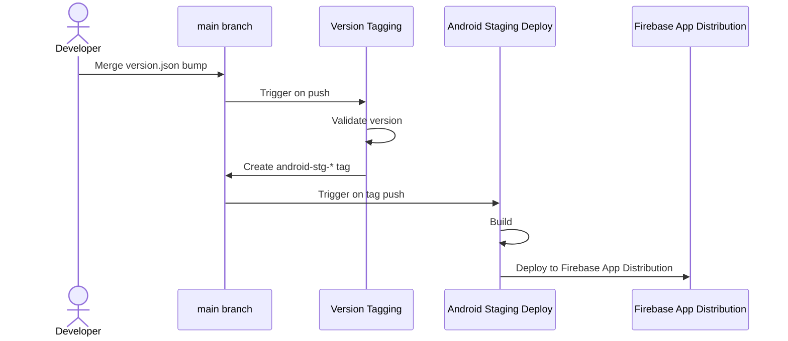

# Deploy

This document describes the project's deployment workflow. Currently only the
**stg** path is implemented — prod isn't wired up yet.

## Workflow overview

The diagram below traces the Android stg release as an example. Every other
channel follows the same shape, differing only in which version file it watches,
which tag prefix it pushes, and what that tag hands off to.



## How to cut a stg release

Update version file(s):

```sh
tool/version.sh bump client/android/version.json --beta
git add client/android/version.json
git commit -m "Bump android stg version to <versionName>"
```

Then push it, or create a PR and merge it to the `main` or a `deploy/*` branch.
Pushing new version file(s) is the only action a developer takes. Everything
past this point is automatic:

1. Version tagging (`.github/workflows/version-tagging.yaml`) runs on the push,
   validates the bump, and tags the commit `android-stg-<versionName>`.
2. Android Staging Deploy (`.github/workflows/android-stg-deploy.yaml`) runs on
   that tag push, builds a release APK, and uploads it to Firebase App
   Distribution.

Each build target keeps its own version file within its directory (e.g.
`client/android/version.json`). It tracks the version that target's next release
should ship as.

### iOS

Same flow, driven by the `ios-stg-` tag prefix. Only step 2 differs: it runs
outside this repo, in an Xcode Cloud workflow configured to trigger on
`ios-stg-*` tags, which builds the app and uploads to TestFlight.

### Server

Same flow, driven by the `server-` tag prefix. Step 2 differs in what it
deploys: `server-deploy.yaml` builds the OpenAPI documentation and publishes it
to GitHub Pages. There's no Go build/compile step in this pipeline.

## Tag protection

A release tag is what actually starts a deploy, so the repo needs an active [tag
ruleset] that restricts creations, updates and deletions, targeting one pattern
per release-tag namespace (`android-stg-*`, `ios-stg-*`, `server-*`, and
whatever prod uses once it exists — an untargeted namespace is unprotected). The
release bot's GitHub App is the only bypass actor, set to _Always allow_.

[tag ruleset]:
  https://docs.github.com/en/repositories/configuring-branches-and-merges-in-your-repository/managing-rulesets/about-rulesets#branch-and-tag-rulesets

## See also

- `tool/version.sh`, which is the tool that bumps a version file and validates a
  bump
- `.github/workflows/version-tagging.yaml`, which observes version files and
  creates release tags when it bumps
- `.github/workflows/android-stg-deploy.yaml`, which is triggered by an
  `android-stg-*` tag and deploys the client app to Firebase App Distribution.
- `client/ios/ci_scripts/ci_post_clone.sh`, which prepares the Xcode Cloud build
  machine for the workflow triggered by an `ios-stg-*` tag.
- `client/ios/ci_scripts/ci_post_xcodebuild.sh`, which verifies the archive that
  workflow produced before it reaches App Store Connect.
- [server-deploy.yaml], which is triggered by a `server-*` tag and publishes the
  OpenAPI documentation to GitHub Pages.

[server-deploy.yaml]: .github/workflows/server-deploy.yaml
