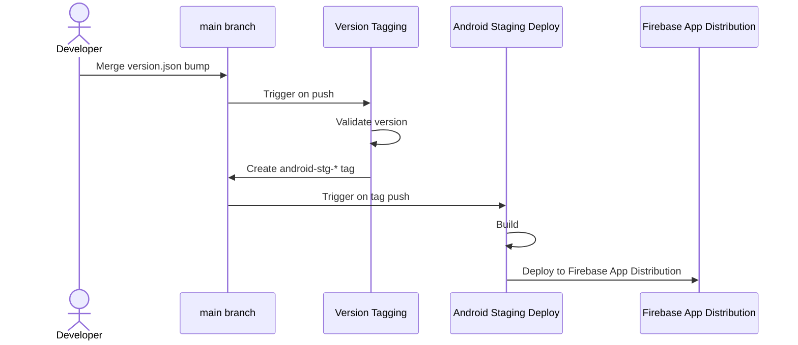

# Deploying the Android app (staging)

Based on the tag-driven release design in the release-CI doc. Currently only the
Android **stg** path is implemented — Android prod and iOS aren't wired up yet.

## Workflow overview



## How to cut a stg release

```sh
tool/version.sh bump client/android/version.json --beta
git add client/android/version.json
git commit -m "Bump android stg version to <versionName>"
# open a PR, get it reviewed, squash-merge to main
```

That's it — merging is the trigger. No manual `git tag`, no manual workflow
dispatch; pushing/merging `client/android/version.json` is the only action a
developer takes. Everything past this point is automatic:

1. **Version Tagging** (`.github/workflows/version-tagging.yaml`) runs on the
   push to `main`, validates the bump, and tags the commit
   `android-stg-<versionName>`.
2. **Android Staging Deploy** (`.github/workflows/android-stg-deploy.yaml`) runs
   on that tag push, builds a release APK, and uploads it to Firebase App
   Distribution's `Dev` group.

Each platform keeps its own version file next to its build files; only the
Android one exists so far, and iOS would get its own (e.g.
`client/ios/version.json`) rather than a key in a shared file. It tracks the
version that platform's next release should ship as.

## Where the details live

Each piece documents its own responsibility in its header comment:

| File                                        | Covers                                                                                      |
| ------------------------------------------- | ------------------------------------------------------------------------------------------- |
| `tool/version.sh`                           | The `version.json` format, the `versionName` scheme, and how to bump and validate a version |
| `.github/workflows/version-tagging.yaml`    | Bump validation, tag naming, and why tagging goes through the release bot's App token       |
| `.github/workflows/android-stg-deploy.yaml` | The release build, signing, Firebase distribution, and the `staging` secrets it needs       |
