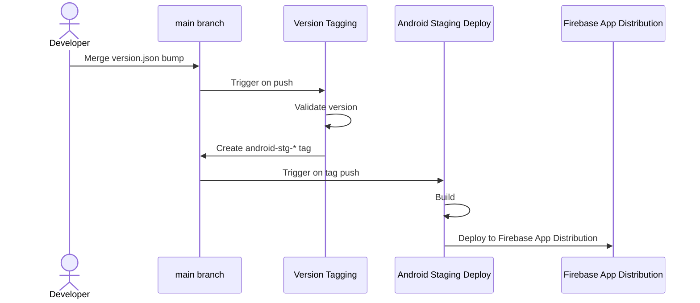

# Deploying the Android app (staging)

Based on the tag-driven release design in the release-CI doc. Currently only the
Android **stg** path is implemented — Android prod and iOS aren't wired up yet.

## Workflow overview



## How to cut a stg release

```sh
tool/version.sh bump client/android/version.json --beta
git add client/android/version.json
git commit -m "Bump android stg version to <versionName>"
# open a PR, get it reviewed, squash-merge to main
```

That's it — merging is the trigger. No manual `git tag`, no manual workflow
dispatch; pushing/merging `client/android/version.json` is the only action a
developer takes. Everything past this point is automatic:

1. **Version Tagging** (`.github/workflows/version-tagging.yaml`) runs on the
   push to `main`, validates the bump, and tags the commit
   `android-stg-<versionName>`.
2. **Android Staging Deploy** (`.github/workflows/android-stg-deploy.yaml`) runs
   on that tag push, builds a release APK, and uploads it to Firebase App
   Distribution's `Dev` group.

Each platform keeps its own version file next to its build files; only the
Android one exists so far, and iOS would get its own (e.g.
`client/ios/version.json`) rather than a key in a shared file. It tracks the
version that platform's next release should ship as.

## Tag protection

A release tag is what actually starts a deploy, so the repo needs an active [tag
ruleset] that restricts creations, updates and deletions, targeting one pattern
per release-tag namespace (`android-stg-*`, and whatever prod and iOS use once
they exist — an untargeted namespace is unprotected). The release bot's GitHub
App is the only bypass actor, set to _Always allow_.

[tag ruleset]:
  https://docs.github.com/en/repositories/configuring-branches-and-merges-in-your-repository/managing-rulesets/about-rulesets#branch-and-tag-rulesets

## See also

- `tool/version.sh`, which is the tool that bumps a version file and validates a
  bump
- `.github/workflows/version-tagging.yaml`, which observes version files and
  creates release tags when it bumps
- `.github/workflows/android-stg-deploy.yaml`, which is triggered by an
  `android-stg-*` tag and deploys the client app to Firebase App Distribution.
