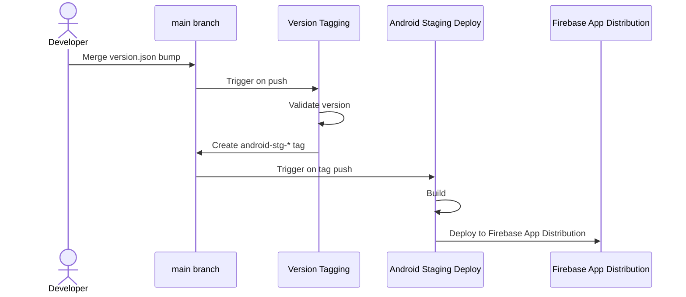

# Deploying the Android app (staging)

Based on the tag-driven release design in the release-CI doc. Currently only the
Android **stg** path is implemented — Android prod and iOS aren't wired up yet.

## Workflow overview



## How to cut a stg release

```sh
tool/version.sh bump client/android/version.json --beta
git add client/android/version.json
git commit -m "Bump android stg version to <versionName>"
# open a PR, get it reviewed, squash-merge to main
```

That's it — merging is the trigger. Everything past this point is automatic:

1. **Version Tagging** (`.github/workflows/version-tagging.yaml`) runs on the
   push to `main`, diffs `client/android/version.json` against the previous
   commit, and validates it with `tool/version.sh comp` (`versionName` format,
   `versionName` newer than before, `buildNumber` == previous + 1). If
   `versionName` ends in `.beta`, it creates a tag `android-stg-<versionName>`
   using the release bot's GitHub App token (a plain `GITHUB_TOKEN`-created tag
   wouldn't trigger the next workflow, so this has to go through the App).
2. **Android Staging Deploy** (`.github/workflows/android-stg-deploy.yaml`) runs
   on that tag push, builds a release APK, and uploads it to Firebase App
   Distribution's `Dev` group.

No manual `git tag` and no manual workflow dispatch — pushing/merging
`client/android/version.json` is the only action a developer takes.

## `client/android/version.json`

Each platform keeps its own version file next to its build files; only the
Android one exists so far, and iOS would get its own (e.g.
`client/ios/version.json`) rather than a key in a shared file. It tracks the
version that platform's next release should ship as. `tool/version.sh` both
maintains it (`bump`) and validates a bump of it (`comp`, which is what the
tagging workflow runs) — see that script's header comment for the file format,
the `versionName` scheme, and CLI usage.

## Where the version actually lands in the app

`version.json` isn't read directly by Gradle. Right before building,
`android-stg-deploy.yaml` renders `client/android/version.json` into
`client/android/version.properties`:

```properties
versionName=1.20260813.123059.beta
versionCode=1
```

`client/android/app/build.gradle.kts` reads `versionCode`/`versionName` from
this file (not from `pubspec.yaml`). The copy committed to the repo is just a
placeholder (`0.0.0.dev` / `1`) for local/debug/profile builds — CI overwrites
it and never commits the result.

## The release build itself

Same build as `make dev` (run from `client/`), just release mode instead of
debug:

```sh
cd client
flutter build apk --release --dart-define-from-file=.env
```

Same `.env` requirement as local dev — `API_BASE_URL` is read from it both by
`--dart-define-from-file` (Dart side) and directly by Gradle
(`BuildConfig.API_BASE_URL`). In CI, `.env` is decoded from the base64
`CLIENT_ENV` secret rather than committed.

Signing works exactly like local dev (see the main README): CI writes
`client/android/signing.properties` by decoding the base64
`ANDROID_SIGNING_PROPERTIES` secret, then decodes `ANDROID_KEYSTORE` (base64) to
whatever relative `keystore.path` that file specifies, under
`client/android/app/`.

## GitHub configuration this depends on

**`staging` environment** (protected):

| Secret / variable                       | Purpose                                                                |
| --------------------------------------- | ---------------------------------------------------------------------- |
| `CLIENT_ENV`                            | Base64-encoded contents of a working `client/.env`                     |
| `ANDROID_SIGNING_PROPERTIES`            | Base64-encoded contents of `client/android/signing.properties`         |
| `ANDROID_KEYSTORE`                      | Base64-encoded release keystore                                        |
| `FIREBASE_APP_DISTRIBUTION_CREDENTIALS` | Base64-encoded service account JSON (App Distribution Admin role only) |
| `FIREBASE_APP_ID`                       | Firebase App ID for `dev.norelease.paperdoll`                          |
| `FIREBASE_TESTER_GROUP` (variable)      | Tester group alias, currently `Dev`                                    |

**Repo/org level** (used by the tagging workflow, not `staging`-scoped):

| Secret / variable           | Purpose                                  |
| --------------------------- | ---------------------------------------- |
| `NORELEASE_BOT_APP_ID`      | The release bot's GitHub App ID          |
| `NORELEASE_BOT_PRIVATE_KEY` | The release bot's GitHub App private key |

The bot's installation needs `contents: write` on this repo to push tags.

## Defense in depth

`android-stg-deploy.yaml` refuses to deploy unless the tag's push actor is
`norelease-bot[bot]` — logged explicitly as a step (not a silent job-level skip)
so a misconfigured check fails loudly instead of looking like a no-op success.
There's no GitHub Ruleset yet restricting who can create `android-stg-*` tags or
push to `deploy/*` branches directly — this check is currently the only
enforcement, until Rulesets are configured.
